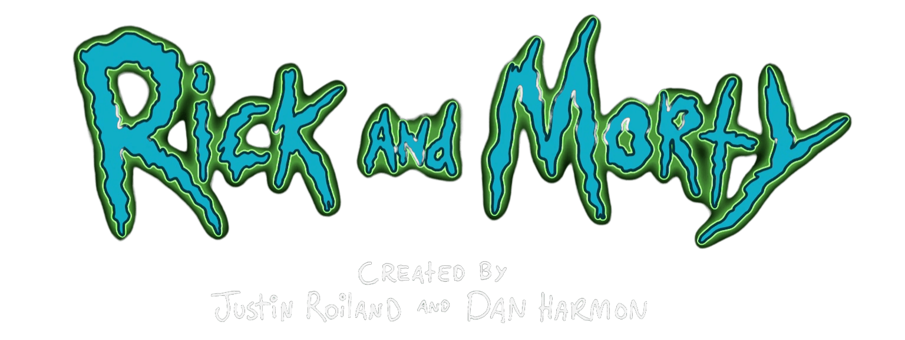

# React module final evaluation

## Author

Lara R. Poblet - [@lrpoblet](https://github.com/lrpoblet)

## Abstract

It is a web page with a list of Rick and Morty characters, which can be filtered by the name of the character and more details information using React for it.

## Specifications

The project have navigable routes within the application.

- A landing page showing all the characters and a search bar.
- A page with the detailed information of the selected character.
- A page that appears in case there is no existing route.

The following technologies have been used in the development of this web application:

- HTML
- CSS
- React
- Event management in the browser
- Access data to a server
- Using git for project version control
- Publishing the result on the Internet using GitHub Pages

## API

The API from which the data has been obtained is:
https://rickandmortyapi.com/

## Other links of interest

- Icons: https://icons8.com/
- Logo: https://es.wikipedia.org/
- Page Not Found: https://codepen.io/hkmtqffr/pen/dVPewm
- Box shadow codes: https://getcssscan.com/
